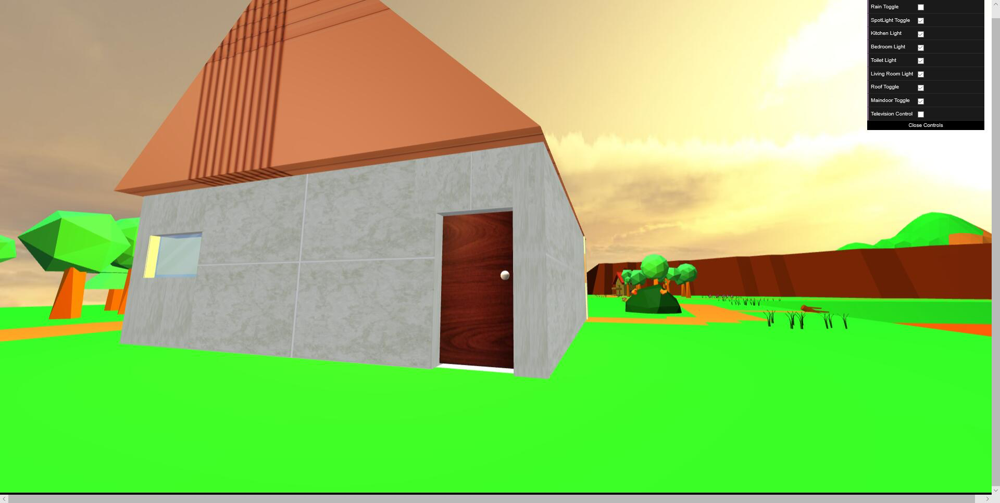
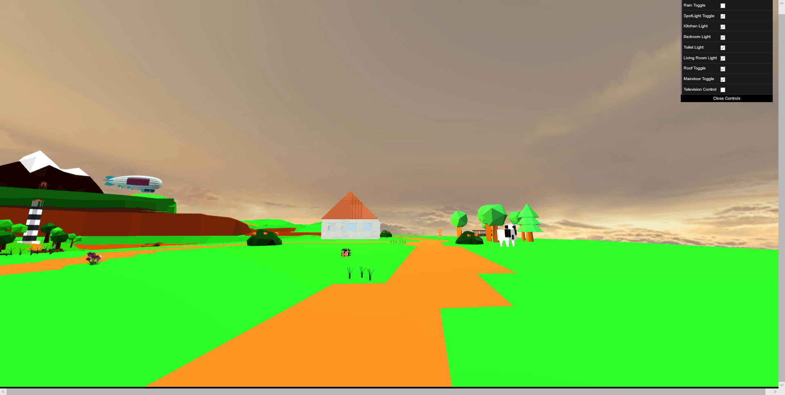

# CG-2018-Course-Project

> Project for the course - Computer Graphics

Hello everyone. Welcome to our team for the CG course and hopefully every one of us can benefit and get good grade.

---

## Important things :smile:

- It is highly recommended to every team member to star, watch and fork this project to be informed by any modification of this project.

- 建议各位都star，watch，fork这个github repository，以便查看重要的修改和日程提示

- One more thing, please try to understand what a .dae file is, how to work with it and how to use a .dae in our project.

## Time line 

| Date  | ddl |
| :-------------: | :-------------: |
|  **Nov. 21**  | submit the subject and team members   |
| 10-th course  | Presentation |
| last experiment course | Final Presentation |

## Members in this project

...

## Tasks

> For the first week, the job of every partner is to learn webgl, javaSJavaScript and three.js by yourself, and think about how many parts are needed for this job. Thus we can split the big project into parts.

> Moreover, we will make a PPT and give a short talk in the class of next to share our ideas (naive ideas:X ) to our groups and teacher.

## Summary of Disscussions

### Fisrt discussion (time: 11-21)

After the disscussion, we got to the consensus of building a scene like Monument Valley (纪念碑谷) or City of Sky (天空之城), which provide the busy modern man with a place to find what really matters in his mind. In this wonderland, we provide players with a place like a mountain, flying high over the ground. You can easily rotate the view and zoom-in and zoom-out to appreciate every aspect of this mountain, just like a God. And do meditation.

Moreover, there are events happening in this place, like dropping a boll, which can be driven by time and events to improve playability. 

### Second Discussion(time: 11-27, partners: all members)

This time we mainly focus on preparing the presentation tomorrow in class. We simply discuss the style, which is determined to be low poly 3D. The technique part is the most troublesome one because the math and drawing are what we learned in this class and we wonder if it is appropriate to spend much time on modeling and designing. We decide about the topic: beautiful and free scene in the sky; Last but not least, the perspective and what can players do are covered.

### Third Discussion(time: 12-08)

We set out time plan and do some simple arrangement;

Inspired by the amazing picture in https://cgi.tutsplus.com/tutorials/secrets-to-creating-low-poly-illustrations-in-blender--cg-31770 We choose to use **Blender**, which is also recommended in class by our teacher.

This week we will give our concentration on the model so we almost done about what need to be appear in our project: floating island, high mountain, river, house and windmill (castle perhaps). We aim to build an amazing scene and we will enjoy doing this.

We will have another discussion next week, and a basic WebGL project have to be finished.

### Forth Discussion(time: 12-16, partners: all dudes)

We check the updates this week, which is not very ideal: the island model made is oversimple and rough, which surely needs to be rebuild. We found some examples for reference and reorganize ourself to go further.

A problem here is that obj model only allow easy static things, That is, all movable things need to be drawed by webgl

This week we will mainly stay in scene constructing, which is divided into two parts. One is keep making our island more beautiful, another is try to build a house that contains furnitures and details.

Keep going~

### Fifth discussion

We talked about our work and other things, and what to do in the next week

### Sixth discussion

Everyone commit their own 3D model to the project

### Seventh

We made a house, added more interaction, enlarge our island and made animals move 

### 1-2 Almost final version

The house and the island are combined together. The collision detection is also almost finished.

