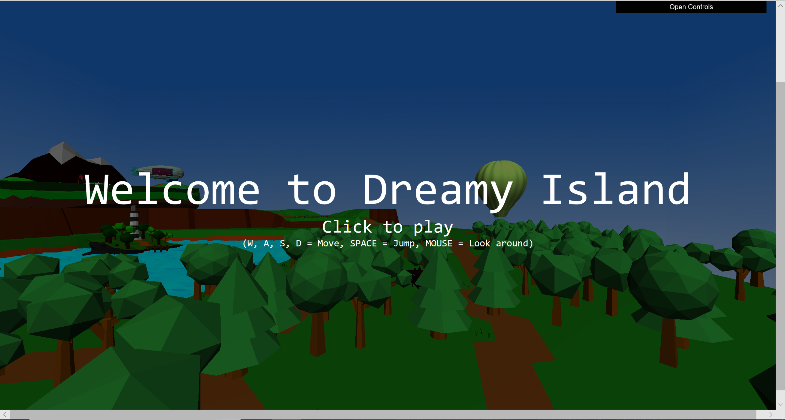

# Oasis in the Sky

> Project of Computer Graphics @ ZJU in 2018-2019 autumn-winter

#### Contributors: (in no particular order)

- [马麟](https://github.com/form2l1n)
- [郝佳辉](https://github.com/NonoHh)
- 徐金焱
- [罗天翔](https://github.com/TTXbai)
- [任宇凡](https://github.com/ryf1123/)

#### Disclaimer: some of the CG models in this project are taken from the Internet, credits belong to the original authors

#### Why "Oasis" ?

Like Walden Pond cherished by Henry David Thoreau's, everyone hopes to have a oasis outside their real life, a place where they can sacrifice benefits🍔🍿🛩 of civilization, but enjoy their life without the restrictions and burden resulted from human society and technology development💰⏰. 

This is a game **Oasis in the Sky**. With WebGL and JavaScript we build an oasis for you, one far from the real world in the sky! (actually in the cyberspace)

There's no particular goal of this game. I mean, you will never lose or win(, unless you fall from the island or encounter some bugs). But during the journey of playing this game, what we want to tell you is,

> You don't have to suppress others to get your goal, you don't have to get more stars, higher scores, you don't have to train every muscle like what you should do if you want to be a professional ethletes. Actually, life is not a competition, it’s a journey. Nevermind, just enjoy it.🍺

#### How to play

`cd /Oasis in the Sky`, open the `index.html` with your favorite browser. (not fully tested on MacOS, but generally compatible on Windows Edge browser)

Wait a little while until the backgroud become blue. Click anywhere to start the game.

Then, you can play this game in the first person perspective to get immersive experience. Use W-A-S-D-SPACE to control steps, use mouse to move your perspective. There are more things you can explore. (I won't tell you that you can actually drive the fire ballon🎈 to get a bird's angle. if you press `E` in it)

#### If you cannot run it...

Thanks for [马麟](https://github.com/form2l1n) who makes a recording of this game. It is available at `/Recording.mp4`

Then you can watch this video recording.

> Thank you for your interest in this project and have fun. We are always open any discussion :)

